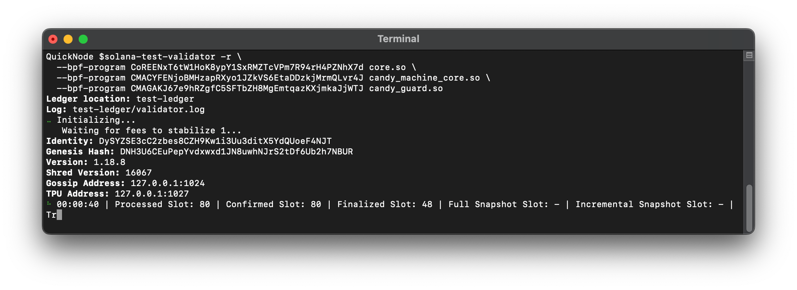
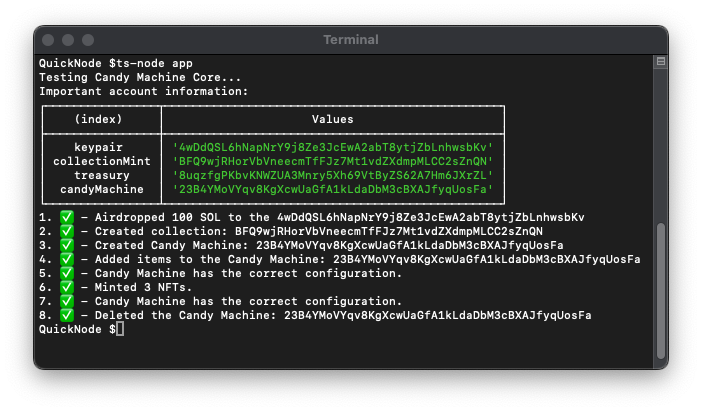

## Metaplex Candy Machine 

---

## How to run/test ?

```
solana program dump -um CoREENxT6tW1HoK8ypY1SxRMZTcVPm7R94rH4PZNhX7d core.so
```

```
solana program dump -um CMACYFENjoBMHzapRXyo1JZkVS6EtaDDzkjMrmQLvr4J candy_machine_core.so
```

```
solana program dump -um CMAGAKJ67e9hRZgfC5SFTbZH8MgEmtqazKXjmkaJjWTJ candy_guard.so
```

```
solana-test-validator -r \
  --bpf-program CoREENxT6tW1HoK8ypY1SxRMZTcVPm7R94rH4PZNhX7d core.so \
  --bpf-program CMACYFENjoBMHzapRXyo1JZkVS6EtaDDzkjMrmQLvr4J candy_machine_core.so \
  --bpf-program CMAGAKJ67e9hRZgfC5SFTbZH8MgEmtqazKXjmkaJjWTJ candy_guard.so
```

The above comment will start your local validator with the programs I have downloaded.


```
ts-node src/index.ts

```

